# UnityShaderBeginner
读《Unity Shader 入门精要》

## 基础篇

### 第 1 章 欢迎来到 Shader 的世界

### 第 2 章 渲染流水线

### 第 3 章 Unity Shader 基础

### 第 4 章 学习 Shader 所需的数学基础

## 初级篇

### 第 5 章 开始 Unity Shader 学习之旅

**用假颜色对Unity Shader进行调试，并且使用颜色拾取器来查看调试信息**

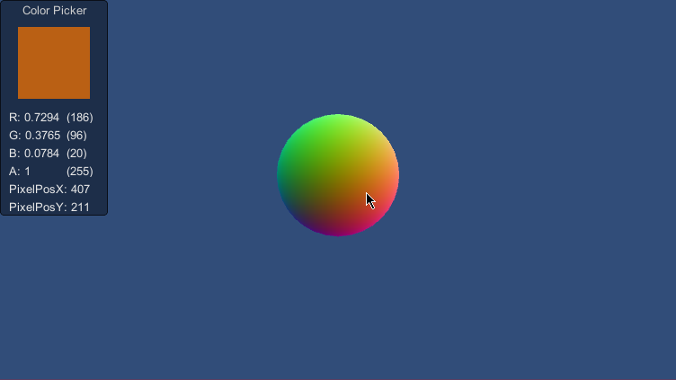

> Chapter5-FalseColor.shader <br>
> ColorPicker.cs

### 第 6 章 Unity 中的基础光照

**逐顶点漫反射光照、逐像素漫反射光照、半兰伯特光照的对比效果**

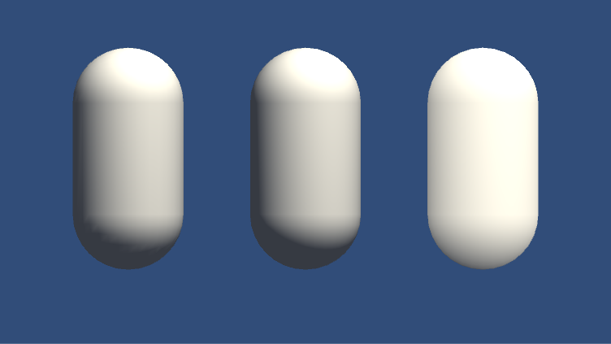

> Chapter6-DiffuseVertexLevel.shader <br>
> Chapter6-DiffusePixelLevel.shader <br>
> Chapter6-HalfLambert.shader


**逐顶点的高光反射光照、逐像素的高光反射光照（Phong光照模型）和Blinn-Phong高光反射光照的对比结果**

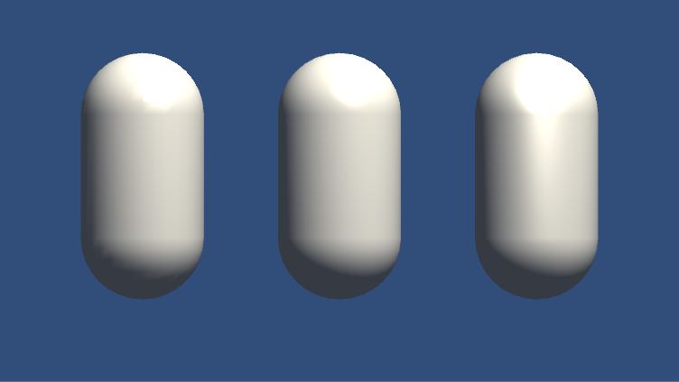

> Chapter6-SpecularVertexLevel.shader <br>
> Chapter6-SpecularPixelLevel.shader <br>
> Chapter6-BlinnPhong.shader <br>
> Chapter6-BlinnPhongUseBuildInFunction.shader（与上面的相同效果）

### 第 7 章 基础纹理

#### 7.1 单张纹理

**用一张纹理来替代物体的漫反射颜色，使用 Blinn-Phong光照模型计算光照。**


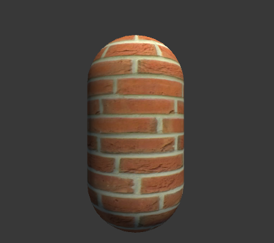

> Chapter7-SingleTexture.shader <br>
> Scene_7_1.unity


**纹理的属性：Tilling & Offset，Wrap Mode，Mipmap，Filter Mode，等。**

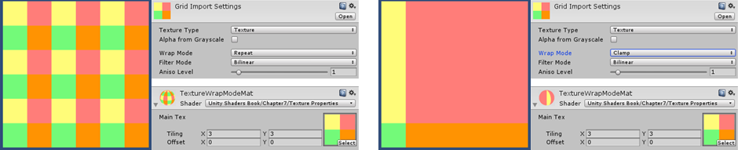

<p align="center">Wrap Mode决定了当纹理坐标超过[0, 1]范围后将会如何被平铺</p> 
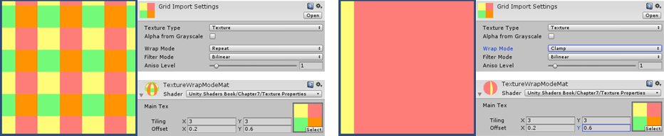

<p align="center">偏移属性决定了纹理坐标的偏移量</p> 
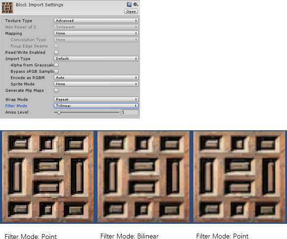

<p align="center">在放大纹理是，分别使用3种Filter Mode得到的结果</p> 


<p align="center">FilterMode+mipmapping</p> 
> Chapter7-TextureProperties.shader <br>
> Scene_7_1_2_a.unity <br>
> Scene_7_1_2_b.unity <br>
> Scene_7_1_2_c.unity

#### 7.2 凹凸映射

凹凸映射主要可以通过两种方式来实现：高度纹理，法线纹理。

法线纹理中存储的法线方向在哪个坐标空间中？可以是：模型空间的法线纹理，切线空间的法线纹理。

需要在计算光照模型中统一各个方向矢量所在的坐标空间。可以是：切线空间下的光照计算，世界空间下的光照计算。

**使用 Bump Scale 属性来调整模型的凹凸程度**

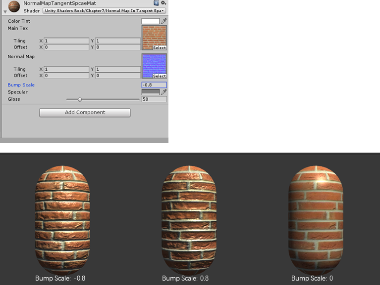

>Chapter7-NormalMapTangentSpace.shader

#### 7.3 渐变纹理 

**使用渐变纹理控制物体的漫反射光照**

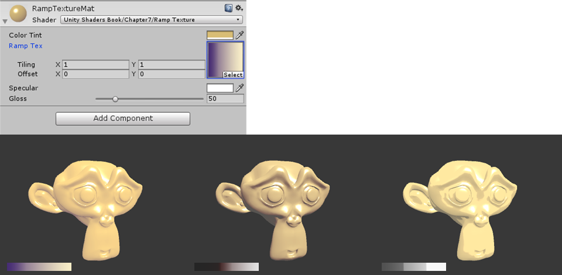

```c++
// 漫反射颜色的计算（使用半兰伯特模型计算的值构建纹理坐标对渐变纹理进行采样）
fixed halfLambert = dot(worldNormal, lightDir) * 0.5 + 0.5;
fixed3 diffuseColor = tex2D(_RampTex, fixed2(halfLambert, halfLambert)).rgb * _Color.rgb;
fixed3 diffuse = _LightColor0.rgb * diffuseColor;
```

> Chapter7-RampTexture.shader

有个疑问，计算 ambient 时，需不需要乘上 diffuseColor。因为 **7.1 单张纹理** 中有 `fixed3 ambient = UNITY_LIGHTMODEL_AMBIENT.xyz * albedo; `。很疑惑。。。（已经在I[ssue224](https://github.com/candycat1992/Unity_Shaders_Book/issues/224)中提问并解答。）

这两种都不是物理精确的，我个人感觉完全按自己喜好选择就好。哈哈。

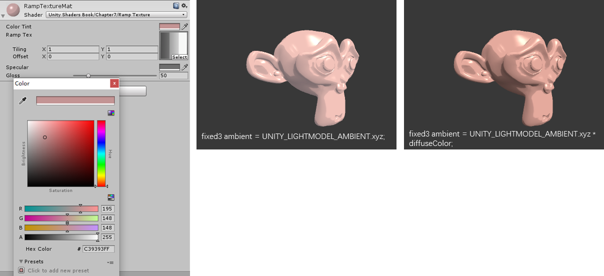

#### 7.4 遮罩纹理

使用高光遮罩纹理，逐像素地控制模型表面的高光反射强度。

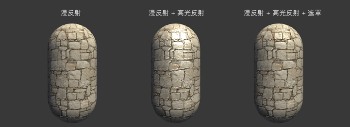

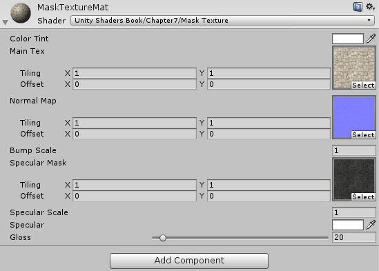


**小Tips**：主纹理、法线纹理和遮罩纹理共同使用一个纹理属性变量 `_Main_Tex_ST`，这样，在材质面板中修改主纹理的平铺和偏移系数会同时影响3个纹理的采样（起到同步的作用），并且可以节省存储的纹理目标数。

> Chapter7-MaskTexture.shader <br>
> Chapter7-MaskTexture_v2.shader

注：可以在这个[链接](http://www.dota2.com/workshop/requirements/)找到《DOTA2》的制作资料。可以看到遮罩纹理的使用。

### 第 8 章 透明效果

#### 8.1 为什么渲染顺序很重要

透明混合技术中，需要关闭深度写入。这会破坏深度缓冲的工作机制。**那么为什么要这样做呢？**

> Ref: https://github.com/candycat1992/Unity_Shaders_Book/issues/22

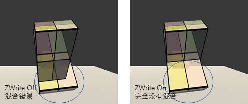

如果你打开了zwrite，透明和透明物体之间就会出现问题。试想两个透明物体A和B，A在前B在后，那么必须是B先渲染A后渲染才会得到正确的结果。但问题是，你无法保证所有的透明物体之间都由完全正确的排序关系，**如果A和B互相遮挡**，那么无论谁先绘制都会发现有一部分是只有一个物体的颜色，而没有发生混合。

当前的半透明解决方法是保证在不透明物体后面、并按从前往后顺序、关闭zwrite，这种方法当然也不是万能的，例如上面说到的A和B互相遮挡下也会出现问题，但出现的错误是“混合错误”，而不是“完全没有进行混合”。**而且关闭了zwrite可以保证一定不会妨碍不透明物体的渲染**，这是非常重要的，即便游戏引擎没有保证先绘制不透明物体，半透明也不会影响游戏里不透明物体的渲染。我认为这是优先级最高的需求。

#### 8.2 Unity Shader 的渲染顺序

#### 8.3 透明度测试

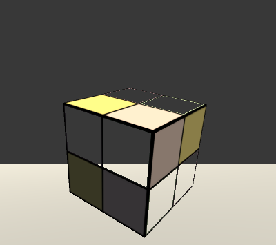

> Chapter8-AlphaTest.shader

#### 8.4 透明度混合

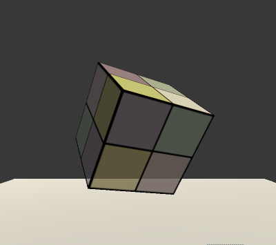

> Chapter8-AlphaBlend.shader

#### 8.5 开启深度写入的半透明效果

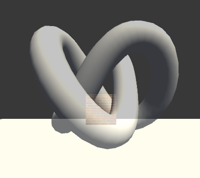

> Chapter8-ALphaBlendZWrite.shader

#### 8.6 ShaderLab 的混合命令

> 图片出处：http://candycat1992.github.io/unity_shaders_book/unity_shaders_book_images.html

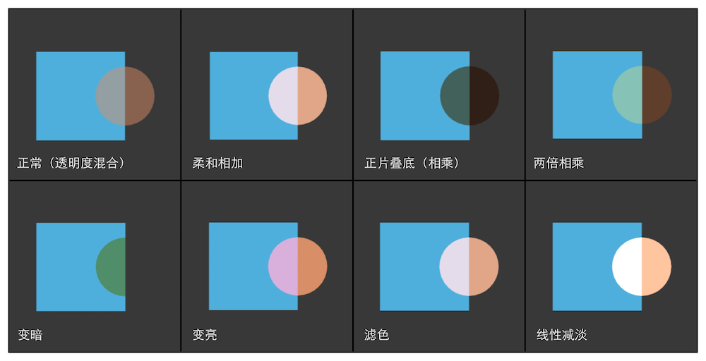

> Chapter8-BlendOperations 0.shader<br>
> Chapter8-BlendOperations 1.shader

#### 8.7 双面渲染的透明效果

**透明度测试的双面渲染**

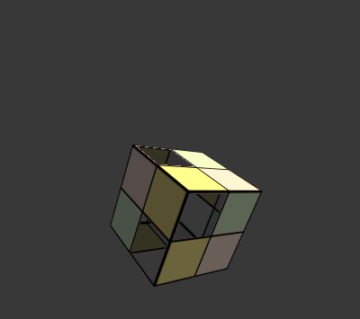

> Chapter8-AlphaTestBothSided.shader

**透明度混合的双面渲染**

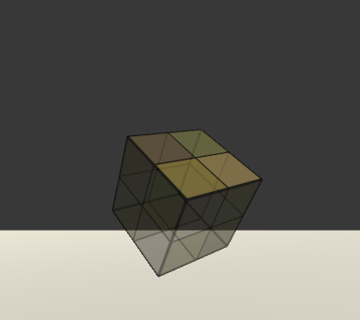

> Chapter8-AlphaBlendBothSided.shader

#### 疑问

如何对复杂模型（非凸网格等）进行双面透明渲染？

在书的第8.7节给出了一个透明度混合的双面渲染的实现，方法是在关闭深度写入的前提下，用两个Pass来分别渲染模型的背面和正面。
上面这种方法可以很好地解决那些模型本身没有遮挡关系的情况。可是一旦模型出现了遮挡，比如书中的Knot模型，依然是会出现混合错误的问题，而且这里显然不能通过进行提前深度测试的方式来解决，因为那样的话，一定是渲染不出背面的（实验结果如下图）。不知道有没有好的解决方法？

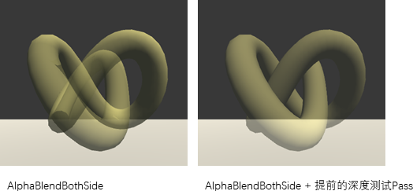

### 第 9 章 更复杂的光照

#### 9.1 Unity 的渲染路径

前向渲染路径，延迟渲染路径和顶点照明渲染路径

> 图片出处：http://candycat1992.github.io/unity_shaders_book/unity_shaders_book_images.html

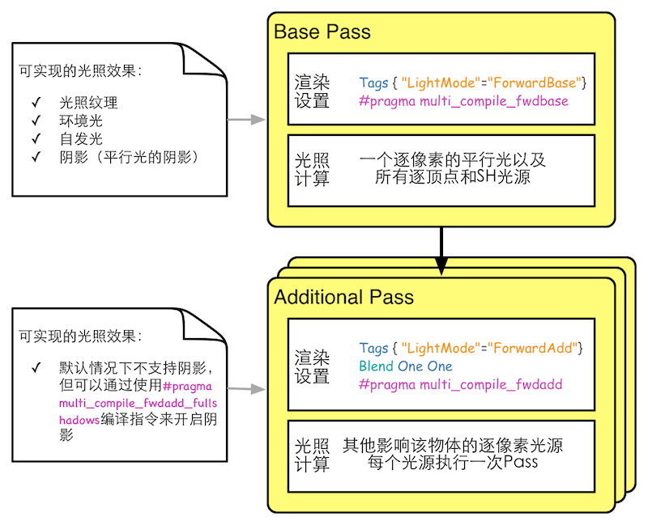

<p align="center"> 前向渲染的两种Pass</p> 
#### 9.2 Unity 的光源类型

平行光，点光源，聚光灯

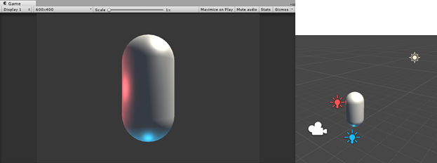

<p align="center"> 使用一个平行光和两个点光源共同照亮物体。右图显示了胶囊体、平行光和点光源在场景中的相对位置</p> 
> Chapter9-ForwardRendering.shader


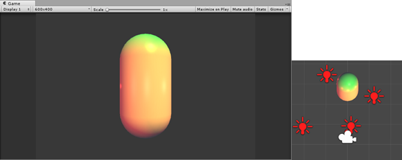

<p align="center"> 使用 1 个平行光 + 4 个点光源照亮一个物体</p> 
> Chapter9-ForwardRendering.shader 不支持逐顶点和SH光源
>
> Chapter9-ForwardRendering_v2.shader 支持逐顶点和SH光源

#### 9.3 Unity 的光照衰减

#### 9.4 Unity 的阴影

**不透明物体的阴影之让物体投射阴影**（存在LightMode 为 ShadowCaster 的 Pass）

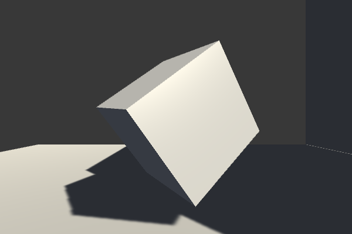

<p align="center">开启 Cast Shadows 和 Receive Shadows，从而让正方体可以投射和接受阴影</p> 
> Chapter9-ForwardRendering.shader
>
> 注：两个 Plane 为默认材质。并且右侧材质的 Cast Shadows 设置为 Two Sided 来允许对其背面也计算阴影。

**不透明物体的阴影之让物体接收阴影**（阴影三剑客：SHADOW_COORDS，TRANSFER_SHADOW，SHADOW_ATTENUATION）


<p align="center">正方体可以接收来自右侧平面的阴影</p> 
> Chapter9-Shadow.shader

**统一管理光照衰减和阴影**（使用内置的 `UNITY_LIGHT_ATTENUATION`来得到光照衰减因子与阴影值的乘积）

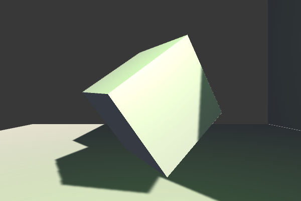

> Chapter9-AttenuationAndShadowUseBuildInFunctions.shader

**透明度物体的阴影之透明度测试**

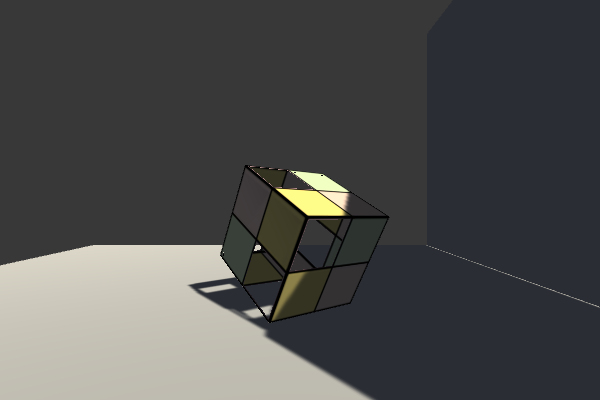

> Chapter9-AlphaTestWithShadow.shader
>
> 需要提供一个具有透明度测试功能的 ShadowCaster Pass，这里是将 Fallback 设置为 `Transparent/Cutout/VertexLit`。

**透明度物体的阴影之透明度混合**

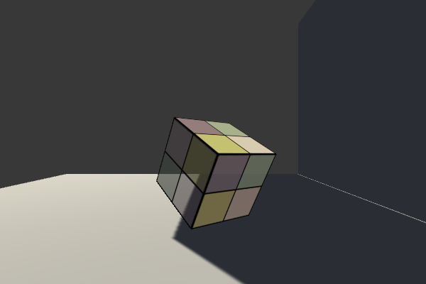

<p align="center">把使用了透明度混合的 Unity Shader 的 Fallback 设置为内置的 Transparent/VertexLit。半透明物体不会向下方投射阴影，也不会接收来自右侧平面的阴影</p>
> Chapter9-AlphaBlendWithShadow.shader
>
> 问：为什么不会接收来自右侧平面的阴影？明明在代码中使用了阴影三剑客。。。


<p align="center">把 Fallback 设为 VertexLit 来强制为半透明物体生成阴影</p>
> Chapter9-AlphaBlendWithShadow.shader
>
> **但与书上不同的是，右侧平面的阴影并没有投射到半透明的立方体上。为什么？**

#### 9.5 本书使用的标准 Unity Shader

> BumpedDiffuse.shader
>
> BumpedSpecular.shader


> 自己添加的透明版本，不接收阴影，也不生成阴影
>
> TransparentBumpedDiffuse.shader
>
> TransparentBumpedSpecular.shader


### 第 10 章 高级纹理

#### 10.1 立方体纹理

**天空盒子**

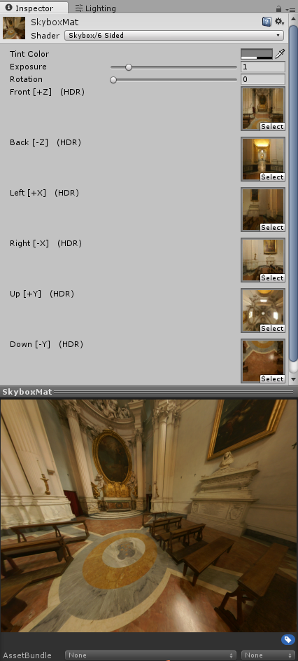

<p align="center">天空盒子材质</p>
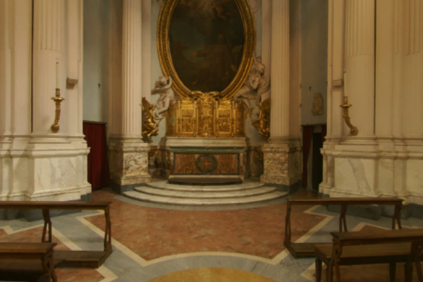

<p align="center">使用了天空盒子的场景</p>
**创建用于环境映射的立方体纹理**

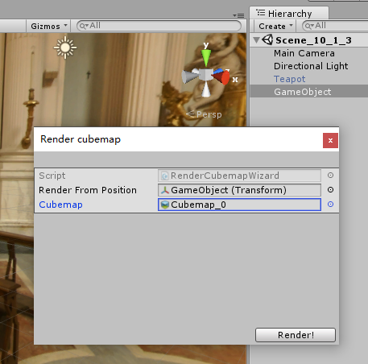

<p align="center">使用脚本创建立方体纹理</p>
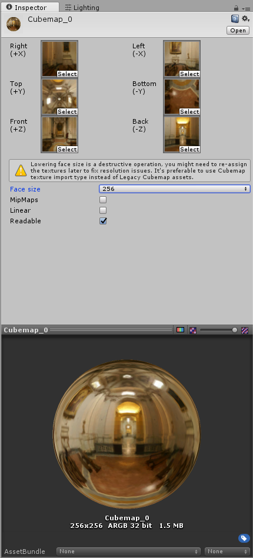

<p align="center">使用脚本渲染立方体纹理</p>
**反射**

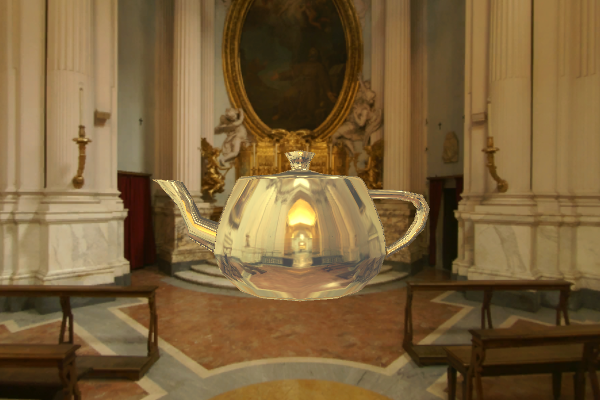

<p align="center">使用了反射效果的 Teapot 模型</p>
**折射**

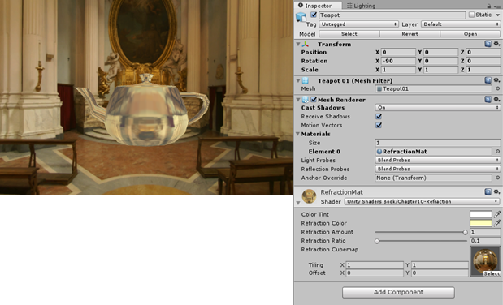

**菲涅尔反射**

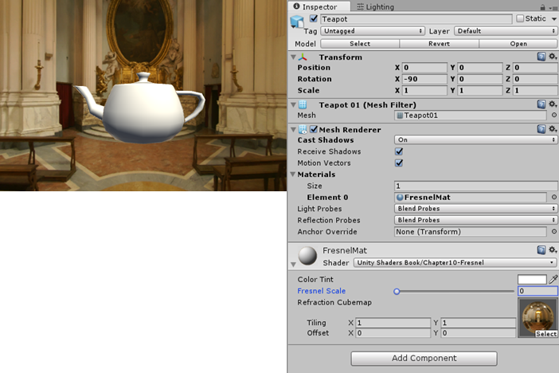

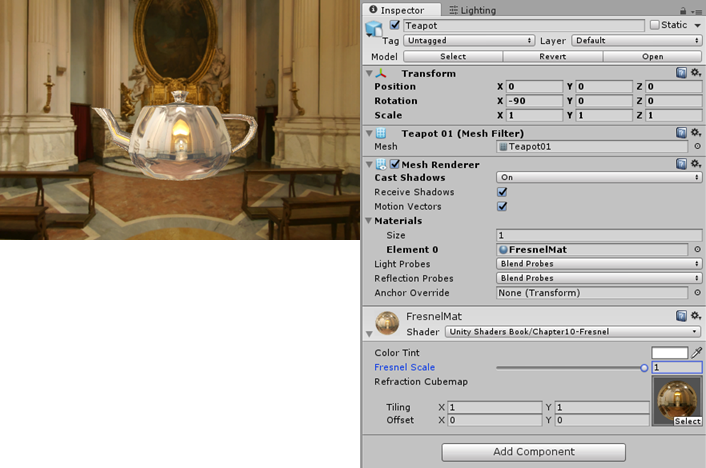

当 FresnelScale 为 0 时，是一个具有边缘光照效果的漫反射物体；当 FresnelScale 为 1 时，物体将完全反射 Cubemap 中的图像。

#### 10.2 渲染纹理

**镜子效果**（在 Project 目录下创建一个渲染纹理，把某个摄像机的渲染目标设置成该渲染纹理）


**玻璃效果**（GrabPass=>折射，Cubemap=>反射）

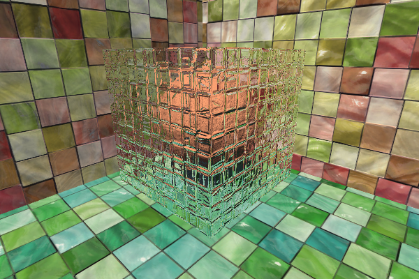


#### 10.3 程序纹理

**在 Unity 中实现简单的程序纹理**

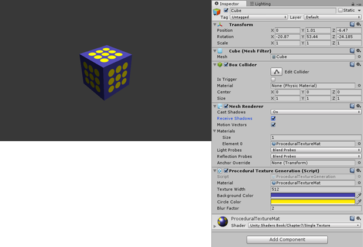

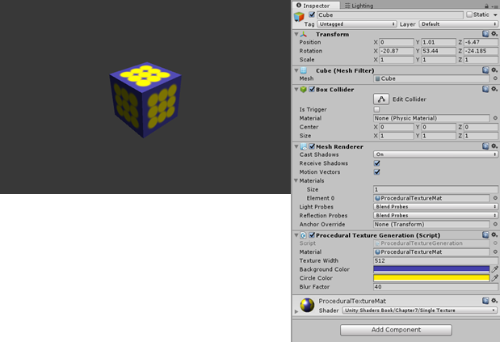

**Unity 的程序材质**

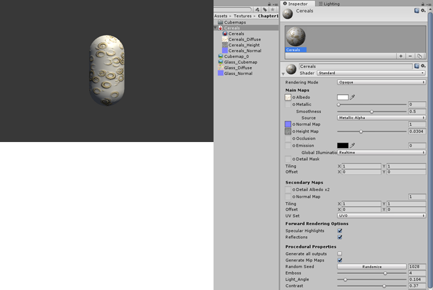


## 高级篇

### 第 12 章 屏幕后处理效果

#### 12.3 边缘检测

1. 用 Sobel 算子，直接利用颜色信息，对屏幕图像进行边缘检测，实现描边效果。
2. 用 Roberts 算子，使用深度和法线信息，对屏幕图像进行边缘检测，实现描边效果。

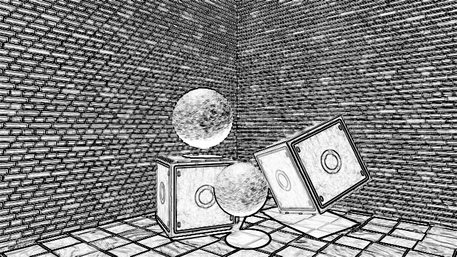

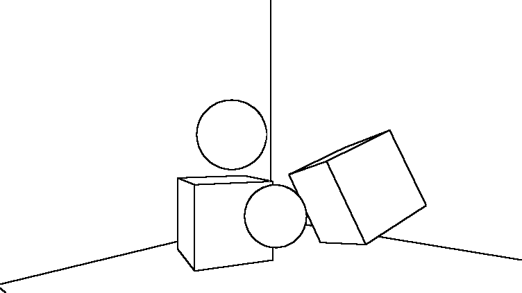

### 第 13 章 使用深度和法线纹理

#### 13.1 查看深度和法线纹理

**线性空间下的深度纹理**

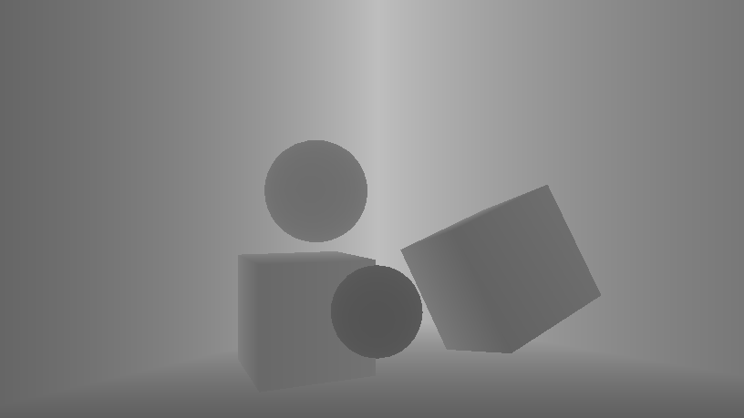

**解码后并且被映射到[0, 1]范围内的视角空间下的法线纹理**

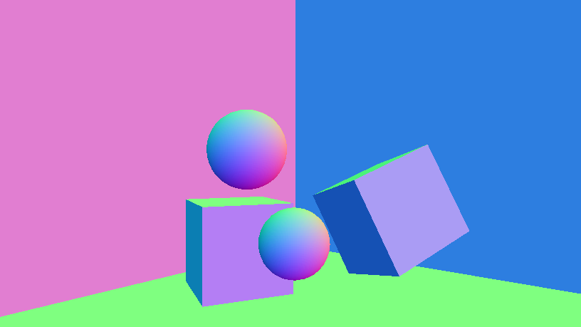

#### 13.2 再谈运动模糊

结合深度纹理进行像素速度的求解。同时给出了一个在片元着色器中为每个元素计算其在世界空间位置的方法，即**uv、深度->NDC->世界坐标**。

> Ref: http://feepingcreature.github.io/math.html


## Custom

### 1. Outline

轮廓线，剔除描边，两个Pass，第一个Pass正常渲染，第二个Pass里让模型顶点沿着法线扩张一定距离，之后做正面剔除，ps里面输出纯色作为描边颜色，这里为红色。示例见Outline Scene。

> ref: https://zhuanlan.zhihu.com/p/31595568

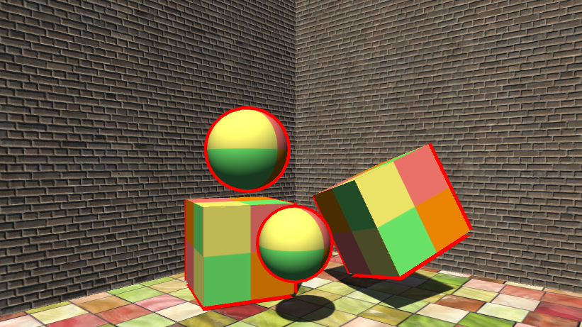

### 2. OutlineBlur

屏幕后处理，得到虚化边框，

1. Draw Solid Color Target Object

2. Copy to buffer2

3. Blur

4. 用 cutoffMaterial 进行 blurBuffer - solidColorRT 操作，得到线框
5. 用 compositeMaterial 进行 原图 + 线框操作

